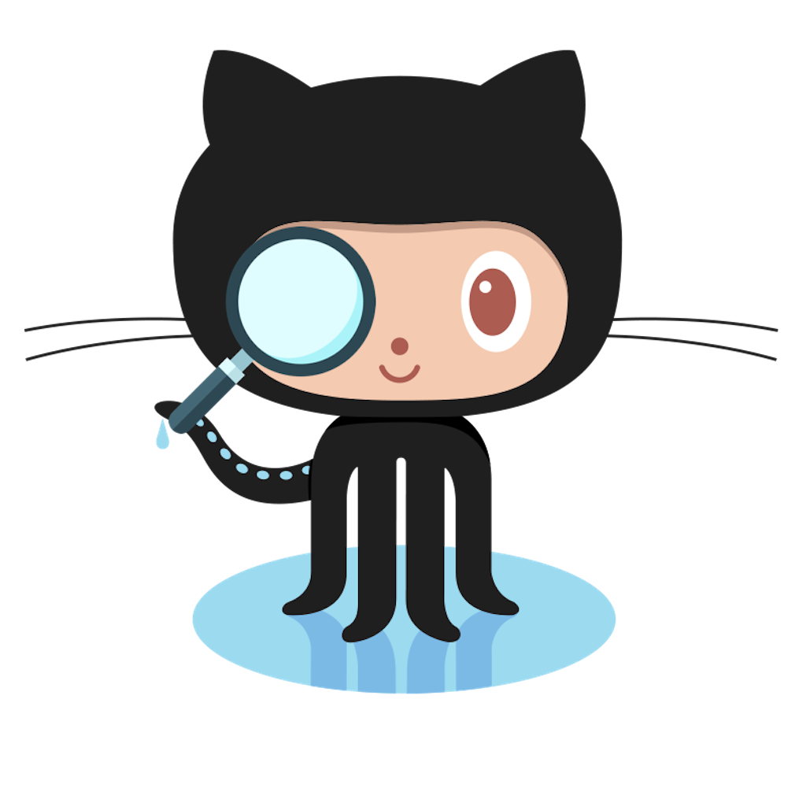
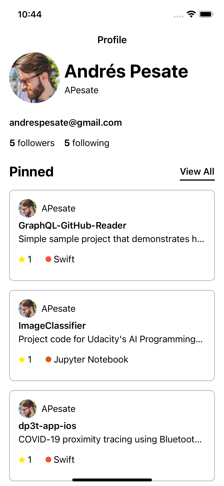
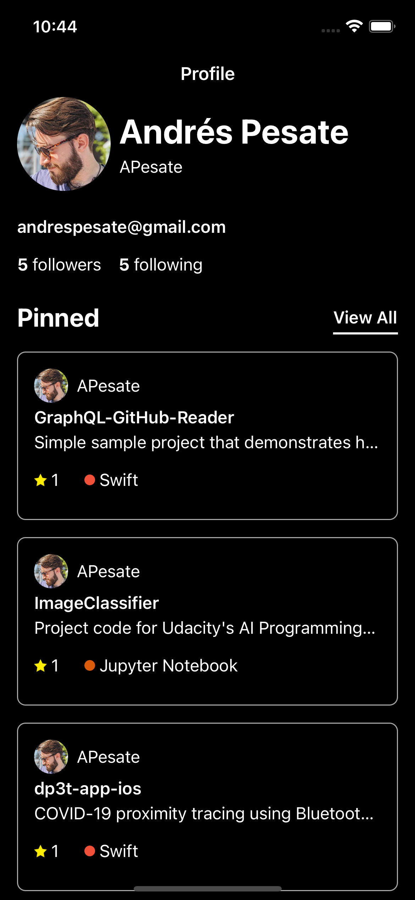

# GHPViewer

**A beatiful way to see your GitHub Profile**

 

---------

## Installation

- The project is splitted in two folders:
  - **GHPViewer:** Contains the iOS Application related files.
  - **Packages:** Contains the three local packages from which the application depends on. For more details about these packages, please check their respective README files.

Steps:
- Run `bundle install` to install the dependencies.
- Open `GHPViewer.xcodeproj`
- Build
- Run

---------

## Usage

Before you run the application be sure to update the [GitHubService.swift](./GHPViewer/GHPViewer/Service/GitHubService.swift) with the correct Authorization Token.

Once the token has been set to the additional headers of the service, the application will build and run as any other iOS project without any further changes required.

**Note**: For the sake of simplicity, the project has hardcoded one username to fetch the profile from github. if you wish to search for a different one be sure to update the parameter in [ProfileSummaryPresenter.swift](./GHPViewer/GHPViewer/Screens/ProfileSummary/Presenter/ProfileSummaryPresenter.swift) at the `loadData()` function.

---------

## Features

- ✅ Connects to GitHub's GraphQL API to retrieve the profile of the specified user. From the profile it will retrieve:
    - Basic user information (Name, Username, Email, Total Count of Followers and Following)
    - The first 3 pinned items.
    - The top 10 repositories.
    - The top 10 starred repositories.
- ✅ The client uses a SQLite DB to cache the data fetched from the server. The current max age for this cache is one day.
- ✅ Beautiful UI in both Light and Dark mode.
- ✅ Localized into three languages: English(default), Spanish, Dutch.
- ✅ Basic setup to build and test the project and its packages on each PR and Merge to master with GitHub Actions.

**Note:** It is possible for users to pin Gists to their profiles. With the current implementation of the project, the app will fail to render the profile if the user has a gist pinned. This is a known issue and will be improved in a future release.

## Roadmap

- ❒ Add support to search for different profiles within the app.
- ❒ Add support for Dynamic Font Sizing while respecting the Design Guidelines.
- ❒ Allow the user to view all the items in a section. (Pinned, Top and Starred Items)
- ❒ Allow the user to see the details of an item.
- ❒ Add support for pinned Gists.
- ❒ Improve cache to not depend on Apollo for it. Currently it has several limitations that compromise the functionality of the app.

------

## Project

## Architecture

- The project was build making use of the [MVP](https://en.wikipedia.org/wiki/Model–view–presenter) design pattern.
- The dependencies are injected in the standard way through initializers. For reference of how this is done, please check the `*Builder` classes.

## Dependencies

- The project is powered by [Apollo](http://apollographql.com) for an explanation on how this is used, please check the README of the `GraphQLClient` package.
- The GitHub GraphQL API [Docs](https://docs.github.com/en/graphql).

### Localization

This project uses [Babelish](https://github.com/netbe/Babelish) to handle the generation of the localization files based on a csv file that serves as source of truth.

This file can be found at: [`GHPViewer/Resources/Localization`](./GHPViewer/GHPViewer/Resources/Localization/Localizable.csv)

## Structure

- **Packages**: Contains the local SPM packages. MockingHelpers, CommonUI & GraphQLClient. For more details about these packages, please be sure to check their respective README files.
- **GHPViewer:** Contains all the files related to the iOS Application.
    - **Common:** Contains the files that are not specific to any section of the app. In case this project needed to support multiple scenes. The SceneDelegate would also fall under this folder.
        - **LaunchScreen**: Contains the LaunchScreen.storyboard
        - **AppDelegate**: Contains the AppDelegate.swift.
        - **UI**: Contains the files related to UI customization, theming and reusable views.
    - **Screens:** Contains the files for each screen available in the application.
        - The structure of these folders, depending on their respective needs, could be as follows:
            - Model
            - View
            - Presenter
            - Components (If needed)
            - Builder
    - **Repositories**: Contains the repositories files and their protocols.
    - **Service**: Contains the Apollo GraphQL generated API file and the Service to connect to GitHub's GraphQL API.
    - **Supporting Files:** Contains the info.plist file.
    - **Resources:** Contains the files for multiple purposes. Localization Files and the Assets catalogue.
  - **GHPViewerTests:** Contains the files corresponding to the tests of the different sections of the app.

## Navigation

  The project at its current state doesn't have any sort of navigation. Nontheless, once the items in the roadmap related to it start being implemented, the [Coordinator](https://www.raywenderlich.com/books/design-patterns-by-tutorials/v3.0/chapters/23-coordinator-pattern) pattern would be the preferred option.

## Unit Tests

The project at its current state only contains a set of tests for the main actors (Presenter, Repository).

The packages also provide their own suit of tests.

The tests follow the Given/When/Then format.

## UI Tests

The project at its current state doesn't contain any UI Tests.

The plan was to do them by making use of the [KIF Framework](https://github.com/kif-framework/KIF) and following the [Robot Pattern](https://academy.realm.io/posts/kau-jake-wharton-testing-robots/).

**Benefits:**

- **KIF:** The benefits of this framework are several, among which I could highlight:
  - Allows you to perform functional tests on your views instead of integration tests.
  - The framework runs on the UnitTests target, which gives you the possibility to perform white box testing by mocking the dependencies. Something that it's not possible to do with the UITests targets.
  - Because it runs on the UnitTests target, we can skip the navigation to specific parts of the app, and directly load the screen in its required state.
- **Robot Pattern:** The pattern is focused on splitting the `What` from the `How` Meaning that you have 2 entities responsable to run the set of tests. The first one is the `XCTestCase` which knows `What` to test and the second would be the `Robot` that knows how to execute the actions.
